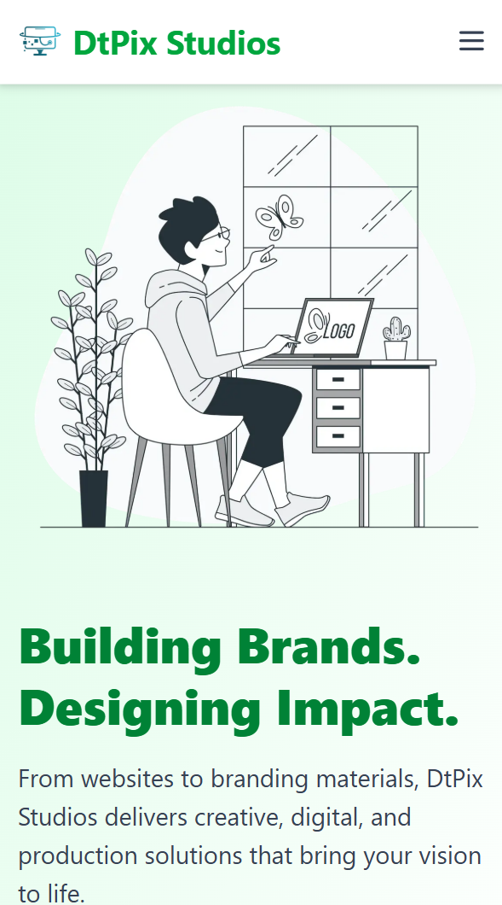
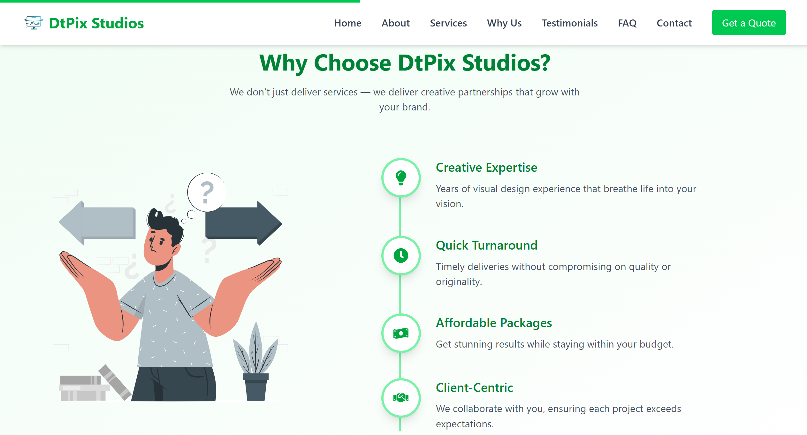

# DtPix Studios – Creative Landing Page 🎬✨

DtPix Studios is a visually captivating and responsive single-page landing site built to showcase a creative agency's services, values, and client trust. Designed with a modern green-themed aesthetic and smooth animations, it's perfect for media, production, or digital creative teams.

## 🌐 Live Preview

## [🔗 Visit DtPix Studios Landing Page](https://dtpixstudios.vercel.app)

## 📸 Demo

### 📱 Mobile View



### 🖥️ Desktop View



---

## 🛠 Tech Stack

- [Next.js 14 (App Router)](https://nextjs.org/)
- [Tailwind CSS](https://tailwindcss.com/)
- [Framer Motion](https://www.framer.com/motion/)
- [Lucide Icons](https://lucide.dev/)
- [Nodemailer](https://nodemailer.com/about/) – Handles email submissions

---

## 🚀 Features

- 📱 **Fully Responsive** – Seamless experience across mobile, tablet, and desktop.
- 🎨 **Mint-Green Themed UI** – Fresh, clean, and vibrant color palette.
- 🧭 **Smooth Scrolling Navigation** – Easy access to all sections.
- 💼 **About & Services Section** – Highlights what DtPix Studios does best.
- ⭐ **Client Testimonials** – Builds trust with real feedback.
- 📊 **Quick Stats Section** – Eye-catching animated counters.
- 💬 **FAQ Accordion** – Answers to commonly asked questions.
- 🧾 **Quote Banner & CTA** – Encourages user engagement.
- 📥 **Contact Form** – Sends email to `info.dtpixstudios@gmail.com`.

---

## 📁 Folder Structure

```
dtpix-studios/
├── app/                    # Next.js App Router structure
│   ├── components/         # Reusable components (Navbar,
├── ├── api/                # Route.ts api
Hero, etc.)
│   ├── styles/             # Tailwind + custom styles
│   ├── assets/             # Images and icons
│   └── page.tsx            # Root landing page
├── public/                 # Static assets
├── tailwind.config.js      # Tailwind customization
├── package.json
└── README.md
```

---

## 🧰 Getting Started

### 1. Clone the Repo

```bash
git clone https://github.com/your-username/dtpix-studios.git
cd dtpix-studios
```

### 2. Install Dependencies

```bash
npm install
# or
yarn install
```

### 3. Start the Dev Server

```bash
npm run dev
# or
yarn dev
```

Visit [http://localhost:3000](http://localhost:3000) to view the site locally.

---

## 📬 Contact

For collaboration or inquiries, feel free to reach out:

📧 **info.dtpixstudios@gmail.com**

---

## 📄 License

This project is licensed under the [MIT License](LICENSE).

---

## ✨ Credits

Created with ❤️ by [**Hari**](https://www.linkedin.com/in/hariharanr18/) and the DtPix Studios Team.
